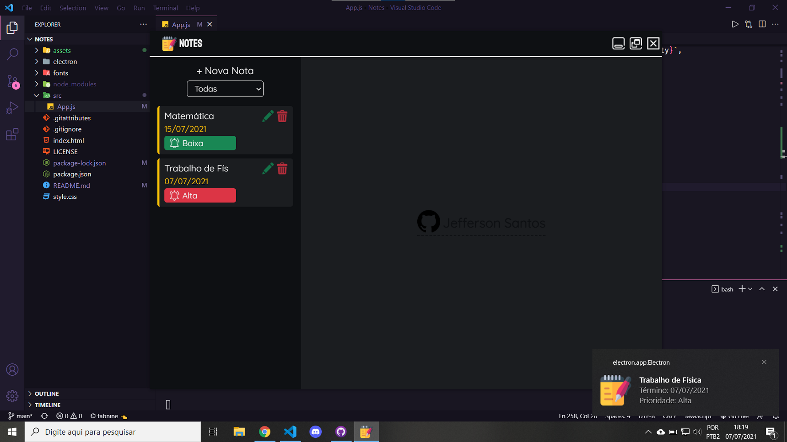

<h1 align="center">
    
</h1>

<h6 align="center">
&#8987; One step at a time
</h6>

    <a href="#introduction">Introduction</a>&nbsp;&nbsp;&nbsp;|&nbsp;&nbsp;&nbsp;
    <a href="#tecnologies">Tecnologies</a>&nbsp;&nbsp;&nbsp;|&nbsp;&nbsp;&nbsp;
    <a href="#install">Install</a>&nbsp;&nbsp;&nbsp;|&nbsp;&nbsp;&nbsp;
    <a href="">Download .exe</a>&nbsp;&nbsp;&nbsp;|&nbsp;&nbsp;&nbsp;
    <a href="#license">License</a>

    
    
    

<h3 id="introduction"> 🏁 Introduction</h3>

Notes is an application for desktop to use everyday for write down your tasks.

<h3 id="tecnologies">  🚀 Tecnologies</h3>

- [Electron JS](https://www.electronjs.org)
- Javascript
- Html5
- Css3
  
<h3 id="install"> &#128187; Install</h3>

1. Clone the repository using `git clone`
2. Enter the folder project
3. Install packages using `npm i` 
4. Run `npm start`
 

<h3 id="license"> 🔒 License </h3>

This project is under MIT license. See the [LICENSE](LICENSE) file for more details.

 

---

<h6>
    Follow me on social media 
    
    
    
</h6>